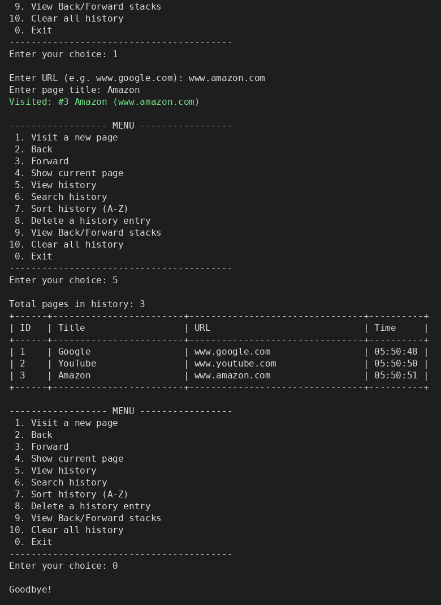
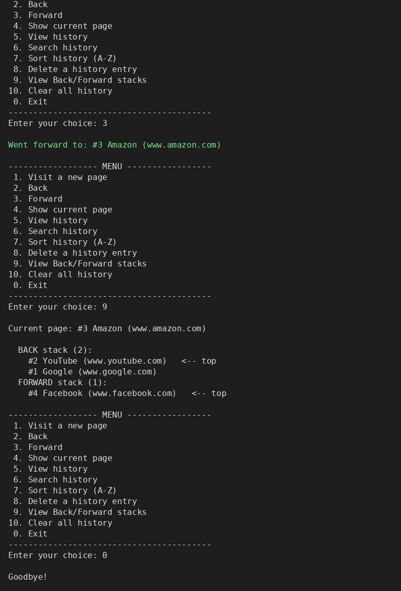
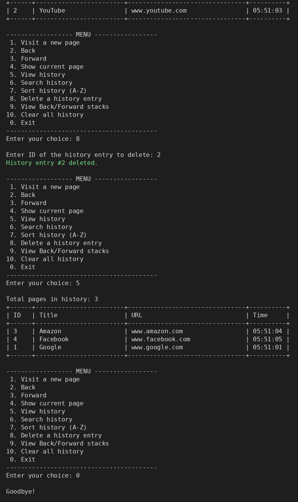

# Browser History Manager

**Course:** Data Structures Lab (CS 216L) – Lab Assignment 1
**Group:** <GroupName> – <Aniqa Arshad-54>, <Ayesha Yaqoob-68>, <Eisha Noor-09>, <Nimra Ilyas-52>
**Language:** Java (console application)
**GitHub Repository:** https://github.com/aniqasatti840-ui<Aniqa Arshad>/CS216L_Project1_GroupName

---

## Description

A menu-driven console application that imitates the history and navigation of a web browser. Every visited page is stored in a **singly linked list**, where it can be searched, sorted and deleted. Navigation uses **two stacks**: a **Back stack** and a **Forward stack**. Visiting a new page pushes the current page on the Back stack and clears the Forward stack, exactly like a real browser.

## Data Structures Used

| Data Structure | Class | Used For |
|---|---|---|
| Singly linked list (head + tail pointers) | `HistoryLinkedList`, `Node` | Storing visited pages: add, delete, search, sort |
| Stack (array-based, auto-resizing) – Back | `PageStack` | Pages the user can go back to |
| Stack (array-based, auto-resizing) – Forward | `PageStack` | Pages the user can go forward to |

**Algorithms**
- **Searching:** Linear Search (keyword in page title or URL, case-insensitive)
- **Sorting:** Merge Sort on the linked list (stable; by title A-Z or by URL A-Z)

**Stack operations implemented:** `push`, `pop`, `peek`, `isEmpty`, `isFull`, `size`, `clear`, `display`

## Features

1. Visit a new page (adds it to the history)
2. Back
3. Forward
4. Show current page
5. View history
6. Search history (by title or URL)
7. Sort history (by title or by URL, using Merge Sort)
8. Delete a history entry (node is detached from the list properly)
9. View Back/Forward stacks
10. Clear all history
0. Exit

Input validation: menu choices are range-checked, non-numeric input is rejected, URLs must have a valid format (no spaces, contains a dot), and empty or too-long titles are not accepted.

## How Back / Forward Works

| Action | Back stack | Forward stack | Current page |
|---|---|---|---|
| Visit new page | push(current page) | clear | new page |
| Back | pop() → becomes current | push(old current) | popped page |
| Forward | push(old current) | pop() → becomes current | popped page |

## Time Complexity

| Operation | Data Structure | Time Complexity | Note |
|---|---|---|---|
| Insert (add visited page) | Linked list | O(1) | tail pointer is maintained |
| Delete (by ID) | Linked list | O(n) | search for the node, then unlink it |
| Search | Linked list (Linear Search) | O(n) | O(n·m) for keyword search, m = keyword length |
| Sort | Linked list (Merge Sort) | O(n log n) | best, average and worst case |
| Push | Stack | O(1) amortized | O(n) only when the array doubles |
| Pop | Stack | O(1) | |
| Back / Forward | Stack | O(1) | one pop + one push |

## Project Structure

```
CS216L_Project1_GroupName/
├── README.md
├── src/
│   ├── Page.java                  # one visited page (id, title, url, time)
│   ├── Node.java                  # linked list node
│   ├── HistoryLinkedList.java     # linked list + linear search + merge sort
│   ├── PageStack.java             # stack used for Back and Forward
│   └── BrowserHistoryManager.java # main class with the menu
└── screenshots/
    ├── screenshot1_visit_and_history.png
    ├── screenshot2_back_forward_stacks.png
    └── screenshot3_sort_search_delete.png
```

## How to Run

**Command line**
```bash
cd src
javac -d ../out *.java
cd ..
java -cp out BrowserHistoryManager
```

**Eclipse / Visual Studio Code:** create a new Java project, copy all files from `src/` into it, and run `BrowserHistoryManager.java`.

## Screenshots




